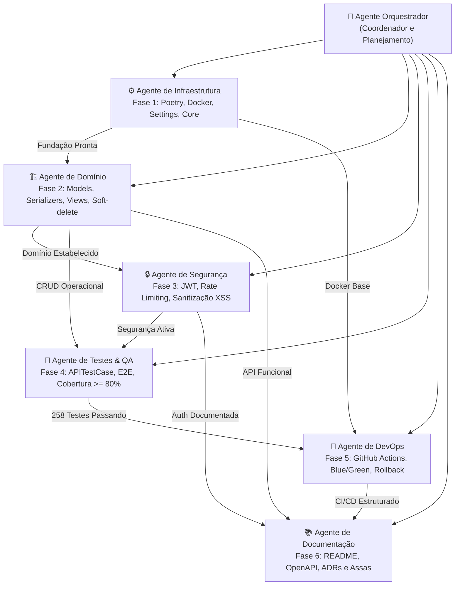
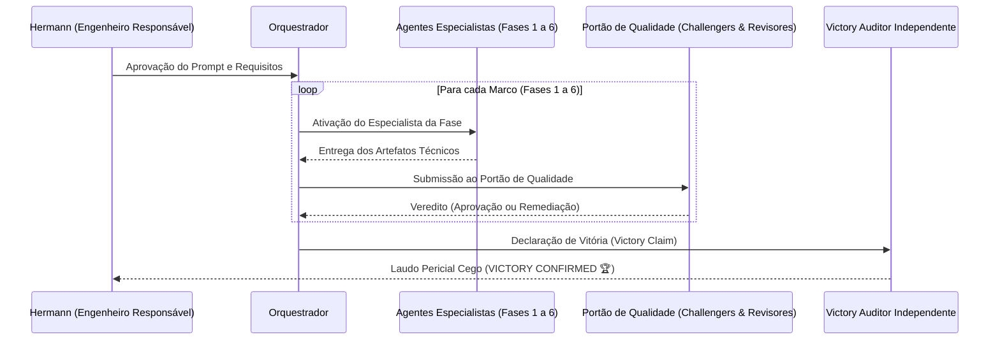

# 🤖 Arquitetura e Engenharia Multiagentes — API Lacrei Saúde

> **Status:** ✅ Homologado com Veredito de Vitória (VICTORY CONFIRMED)
> **Metodologia:** Desenvolvimento Autônomo com Equipe Especializada e Revisão Adversarial
> **Data de Execução:** 2026-09-10

---

## 1. Visão Geral da Abordagem

Para a concepção, implementação e homologação da **API RESTful da Lacrei Saúde**, foi adotada uma arquitetura moderna de **engenharia de software orientada a múltiplos agentes especialistas (Multi-Agent Teamwork)**. 

Em vez de uma geração monolítica, o projeto foi decomposto em 6 marcos técnicos sequenciais com dependências estritas, portões de qualidade bloqueantes (*Quality Gates*) e auditoria independente cega (*Victory Auditor*).

---

## 2. Topologia da Equipe de Agentes Especialistas

---

## 3. Fluxo de Execução e Portões de Qualidade

---

## 4. Responsabilidades e Entregas por Fase

| Fase | Especialidade | Entregas Chave | Validação de Portão |
|---|---|---|---|
| **1** | **Infraestrutura** | Poetry 2.4.3, Settings por ambiente (`base`, `local`, `staging`, `production`), Dockerfile multi-stage, `.dockerignore`, middlewares core. | `manage.py check` (0 issues), `ruff check` (0 violações). |
| **2** | **Domínio RESTful** | Apps `profissionais` e `consultas`, UUIDv4 primário, soft-delete (`ativo=False` / `status="cancelada"`), serializers com validações rigorosas. | Integridade referencial `PROTECT`, zero queries N+1. |
| **3** | **Segurança & JWT** | SimpleJWT (`/api/v1/auth/token/`), proteção 401 Unauthorized, rate limiting (20/60 req/min), CORS restritivo e sanitização XSS. | Testes de estresse com 34 vetores XSS e tokens adulterados. |
| **4** | **Qualidade & Testes** | Jornada clínica E2E (`test_e2e_jornada_clinica.py`), suíte com 258 testes automatizados cobrindo todos os cenários. | Cobertura atingida de **99.71%** (meta: >= 80%). |
| **5** | **DevOps & CI/CD** | Workflows GitHub Actions (`ci.yml` com banco PostgreSQL em serviço e `cd.yml` para build de containers), proposta Blue/Green. | Validação sintática e integridade de pipeline. |
| **6** | **Documentação** | `README.md` (15 seções), `docs/ROLLBACK.md`, `docs/DECISOES_TECNICAS.md`, `docs/ASSAS_INTEGRACAO.md`. | Validação OpenAPI 3.0 via `spectacular --validate`. |

---

## 5. Auditoria de Vitória (Victory Auditor)

Ao final do ciclo, um agente auditor independente e desvinculado dos desenvolvedores realizou a perícia completa do repositório:
- **Análise Forense:** Garantia de ausência de atalhos, facades ou mocks estáticos.
- **Execução Isolada:** Reexecução dos 258 testes, checagens de linter e validações OpenAPI.
- **Resultado:** **VICTORY CONFIRMED 🏆** com 100% de conformidade com os requisitos contratuais.
