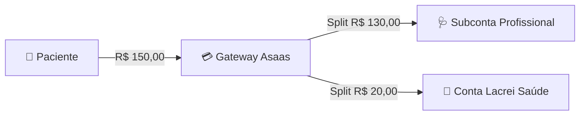
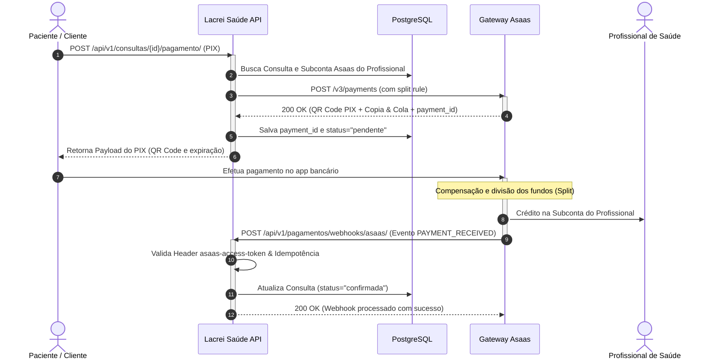

# Proposta Técnica: Integração com Gateway de Pagamentos Asaas — API Lacrei Saúde

Este documento descreve a especificação arquitetural, fluxo de dados, eventos de mensageria e requisitos de segurança para a integração da API Lacrei Saúde com a infraestrutura de pagamentos e split da **Asaas**.

---

## 1. Visão Geral e Modelo de Negócio

Na plataforma Lacrei Saúde, o modelo financeiro de intermediação de consultas médicas prevê a divisão automática de valores (*Payment Split*):
1. O paciente realiza o pagamento de uma consulta agendada (via PIX, Cartão de Crédito ou Boleto).
2. O gateway de pagamento processa a cobrança.
3. O valor bruto é dividido na fonte:
   - **Taxa da Plataforma (Take-rate / Split Fixo ou Percentual)**: Retido pela conta principal da Lacrei Saúde para sustentabilidade e infraestrutura.
   - **Remuneração do Profissional**: Repassada diretamente para a subconta (*wallet*) do profissional de saúde cadastrado.



---

## 2. Diagrama de Fluxo e Ciclo de Vida da Transação



---

## 3. Especificação dos Endpoints Propostos (Mock / Futura Implementação)

Para suportar o fluxo de split, propõe-se a criação do app `apps.pagamentos` com os seguintes endpoints:

### 3.1 `POST /api/v1/consultas/{id}/pagamento/`
Inicia o processo de cobrança para uma consulta existente.
- **Autenticação**: Bearer JWT.
- **Exemplo de Payload de Entrada**:
```json
{
  "forma_pagamento": "PIX"
}
```
- **Exemplo de Resposta (HTTP 201 Created)**:
```json
{
  "id_transacao": "pay_982341908234",
  "consulta_id": "d3b07384-d113-4944-9c8e-32491a6d47d9",
  "valor": "150.00",
  "status": "aguardando_pagamento",
  "pix_qr_code": "data:imagepng;base64,iVBORw0KGgo...",
  "pix_copia_cola": "00020126580014br.gov.bcb.pix0136...",
  "expira_em": "2026-09-10T15:30:00Z"
}
```

### 3.2 `POST /api/v1/pagamentos/webhooks/asaas/`
Endpoint receptor de notificações assíncronas do Asaas.
- **Autenticação**: Header secreto `asaas-access-token`.
- **Exemplo de Payload Recebido (Webhook Event)**:
```json
{
  "id": "evt_00192837465",
  "event": "PAYMENT_RECEIVED",
  "payment": {
    "id": "pay_982341908234",
    "customer": "cus_000005234123",
    "value": 150.00,
    "netValue": 147.51,
    "billingType": "PIX",
    "confirmedDate": "2026-09-10",
    "status": "RECEIVED",
    "split": [
      {
        "walletId": "wallet_medico_uuid_123",
        "fixedValue": 130.00,
        "status": "DONE"
      },
      {
        "walletId": "wallet_lacrei_principal",
        "fixedValue": 20.00,
        "status": "DONE"
      }
    ]
  }
}
```

---

## 4. Tabela de Eventos de Webhook Suportados

| Evento | Descrição do Ciclo | Ação no Sistema Lacrei Saúde |
|---|---|---|
| `PAYMENT_CREATED` | Cobrança gerada no Asaas. | Registra transação como `pendente`. |
| `PAYMENT_RECEIVED` | Pagamento compensado via PIX/Boleto. | Altera consulta para `status="confirmada"`. Notifica paciente e profissional. |
| `PAYMENT_CONFIRMED` | Pagamento com cartão de crédito aprovado. | Altera consulta para `status="confirmada"`. |
| `PAYMENT_OVERDUE` | Cobrança venceu sem pagamento. | Cancela agendamento pendente liberando o horário na agenda do profissional. |
| `PAYMENT_REFUNDED` | Estorno total solicitado/efetuado. | Reverte status da consulta e cancela repasses do split. |
| `SPLIT_PAID` | Split transferido com sucesso para a subconta. | Registra comprovante contábil do repasse ao profissional. |

---

## 5. Requisitos de Segurança e Conformidade

### 5.1 Conformidade PCI DSS (Payment Card Industry Data Security Standard)
- O backend da API Lacrei Saúde **nunca** armazena, processa ou trafega números de cartão de crédito, CVV ou datas de validade em texto claro em seus servidores.
- No caso de pagamentos com cartão, a captura deve utilizar a solução de **Tokenização no Frontend** fornecida pelo SDK da Asaas, enviando ao backend Django apenas o `creditCardToken` resultante.

### 5.2 Validação de Autenticidade do Webhook
Para garantir que a notificação provém legitimamente do Asaas e repelir ataques de personificação:
1. Validação estrita do token secreto recebido no header `asaas-access-token` contra a variável segura `ASAAS_WEBHOOK_SECRET` definida nas configurações do Django.
2. Rejeição imediata com `HTTP 403 Forbidden` se o token estiver ausente ou inválido.

### 5.3 Garantia de Idempotência
Gateways de pagamento podem reenviar webhooks em caso de latência de resposta. O manipulador do webhook deve ser estritamente idempotente:
- Criação de tabela `TransacaoWebhookLog` armazenando o `event_id` único do webhook.
- Se o evento já tiver sido processado, responder imediatamente com `HTTP 200 OK` sem reaplicar as alterações de banco de dados.

---

## 6. Referências e Documentação Oficial da Asaas

- **Portal de Desenvolvedores Asaas**: [https://docs.asaas.com/](https://docs.asaas.com/)
- **API de Criação de Cobranças**: [https://docs.asaas.com/reference/criar-nova-cobranca](https://docs.asaas.com/reference/criar-nova-cobranca)
- **Documentação de Split de Pagamentos**: [https://docs.asaas.com/reference/split-de-pagamentos](https://docs.asaas.com/reference/split-de-pagamentos)
- **Guia e Configuração de Webhooks**: [https://docs.asaas.com/reference/webhooks](https://docs.asaas.com/reference/webhooks)
