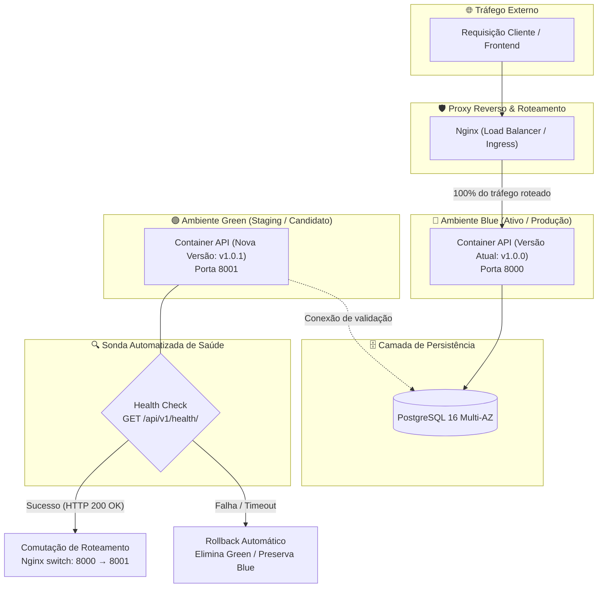

# Estratégia de Deploy Blue/Green e Procedimentos de Rollback — API Lacrei Saúde

Este documento estabelece o protocolo operacional de implantação contínua e tolerância a falhas da API Lacrei Saúde, orientando equipes de engenharia e operações na mitigação e reversão ágil de incidentes em ambientes de Staging e Produção.

---

## 1. Arquitetura de Deploy Blue/Green

A estratégia de implantação da Lacrei Saúde adota o padrão **Blue/Green Deployment**, garantindo zero downtime (*zero downtime deployment*) e minimizando a janela de exposição a eventuais falhas em novas versões da aplicação.

### 1.1 Diagrama de Fluxo e Alternância de Tráfego



---

## 2. Procedimento de Rollback Automático (Health Check)

O pipeline de CD (`.github/workflows/cd.yml`) orquestra o deploy executando testes sintéticos e checagens ativas antes de liberar o tráfego de produção para a nova versão.

### 2.1 Critérios de Validação da Sonda
- **Endpoint**: `/api/v1/health/`
- **Contrato de Resposta**: `{"status": "ok", "app": "lacrei-saude-api"}` com status `HTTP 200 OK`.
- **Características do Endpoint**:
  - Totalmente público e desacoplado de dependências frágeis (garante resposta < 50ms).
  - Imune a throttling/rate limiting (evita falsos-positivos sob rajadas de tráfego).
- **Janela de Tolerância**: 10 tentativas com intervalo de 3 segundos (totalizando 30 segundos de warm-up).

### 2.2 Algoritmo de Decisão do Pipeline de Deploy

```bash
# 1. Inicialização do container candidato (Green) em porta não exposta ao tráfego público
docker run -d --name api-green -p 8001:8000 \
  --env-file /etc/lacrei/.env.production \
  lacrei-saude-api:${TAG}

# 2. Verificação ativa de saúde do container Green
HEALTHY=false
for i in {1..10}; do
  HTTP_STATUS=$(curl -s -o /dev/null -w "%{http_code}" http://localhost:8001/api/v1/health/ || true)
  if [ "$HTTP_STATUS" -eq 200 ]; then
    echo "✅ Health check aprovado na tentativa $i."
    HEALTHY=true
    break
  fi
  echo "⚠️ Tentativa $i: aplicação indisponível (HTTP $HTTP_STATUS). Aguardando 3s..."
  sleep 3
done

# 3. Ramificação do Rollback vs Promoção
if [ "$HEALTHY" = false ]; then
  echo "❌ FALHA CRÍTICA: Health check não respondeu com HTTP 200 após 30s."
  echo "🔄 Acionando Rollback Automático Imediato..."
  docker stop api-green || true
  docker rm api-green || true
  echo "🛡️ Ambiente Blue mantido ativo e intocado. Deploy cancelado sem impacto aos usuários."
  exit 1
fi

# 4. Promoção: Comutação no Nginx e recarregamento gracioso (graceful reload)
echo "🚀 Comutando tráfego do Nginx para a nova versão (Green)..."
sed -i 's/127.0.0.1:8000/127.0.0.1:8001/' /etc/nginx/conf.d/default.conf
nginx -s reload

# 5. Descomissionamento seguro do container anterior
docker stop api-blue || true
docker rm api-blue || true
docker rename api-green api-blue
sed -i 's/127.0.0.1:8001/127.0.0.1:8000/' /etc/nginx/conf.d/default.conf
echo "✨ Deploy concluído com sucesso absoluto."
```

---

## 3. Procedimento de Rollback Manual

Caso ocorra uma regressão funcional, inconsistência negocial ou problema que não seja capturado na inicialização da aplicação, deve-se acionar o rollback manual.

### 3.1 Opção A: Rollback via GitHub Actions (Reimplantação de Tag Estável)
1. Acesse o repositório no GitHub: **Actions** → **CD — Build & Deploy**.
2. Identifique a última execução bem-sucedida na branch `main`.
3. Selecione **Re-run all jobs** ou acione o workflow dispatch informando o hash/tag estável anterior (ex: `main-a1b2c3d`).
4. O pipeline compilará/implantará a imagem validada, restaurando a estabilidade do cluster.

### 3.2 Opção B: Rollback via Git Revert (Rastreabilidade Auditável)
Para manter o histórico do Git rigorosamente linear e auditável:

```bash
# 1. Atualizar cópia local da branch main
git checkout main
git pull origin main

# 2. Reverter o commit causador do incidente
git revert <HASH_COMMIT_COM_PROBLEMA> -m 1 --no-edit

# 3. Enviar o commit de reversão diretamente para a main
git push origin main
```
*O push acionará imediatamente o pipeline `.github/workflows/cd.yml`, aplicando o rollback de forma padronizada.*

### 3.3 Opção C: Rollback Emergencial Direto na Instância EC2
Em situações de indisponibilidade extrema de rede ou falha no GitHub Actions:

```bash
# Conectar via SSH à instância de produção
ssh -i deploy_key.pem ubuntu@api.lacreisaude.com.br

# Acessar diretório operacional
cd /opt/lacrei-saude

# Retornar o container anterior a partir da imagem preservada no Docker daemon
docker stop api-blue
docker run -d --name api-blue-recovered -p 8000:8000 \
  --env-file .env.production \
  lacrei-saude-api:<TAG_ESTAVEL_ANTERIOR>

# Recarregar o Nginx
sudo nginx -t && sudo systemctl reload nginx
```

---

## 4. Rollback e Gestão de Migrações no Banco de Dados

### 4.1 Princípio de Compatibilidade Retroativa (Expand & Contract)
Alterações de schema de banco de dados **nunca** devem introduzir *breaking changes* imediatas. Deve-se aplicar o padrão **Two-Phase Migration (Expand & Contract)**:
1. **Fase 1 (Expand)**: Adição de novas colunas ou tabelas com `null=True` ou valores padrão. Código novo lê o novo schema; código antigo continua funcionando.
2. **Fase 2 (Contract)**: Após estabilização da versão em produção, removem-se campos obsoletos em uma release separada.

### 4.2 Diagnóstico do Estado de Migrações
Para verificar o estado atual das migrações aplicadas no banco:
```bash
python manage.py showmigrations
```

### 4.3 Reversão Controlada de Migrações
Para reverter uma aplicação para uma migração anterior:
```bash
# Exemplo: Reverter app 'consultas' para a migração 0001
python manage.py migrate consultas 0001_initial

# Exemplo: Reverter app 'profissionais' para a migração inicial
python manage.py migrate profissionais 0001_initial

# Reverter todas as migrações de um app (cuidado extremo: destrutivo)
python manage.py migrate consultas zero
```

> ⚠️ **Atenção:** Se a migração deletou colunas ou modificou tipos de dados de forma irreversível sem backup, o rollback de schema exigirá a restauração do snapshot point-in-time do PostgreSQL.

---

## 5. Matriz de Cenários de Falha e Planos de Ação

| Cenário de Falha | Sintoma | Causa Raiz Provável | Ação de Mitigação Imediata | Procedimento de Rollback |
|---|---|---|---|---|
| **1. Falha de Boot da API** | Health check falha com HTTP 502 / Connection Refused no teste Green. | Erro de sintaxe, variável de ambiente faltante ou falha de importação. | Verificar logs: `docker logs api-green`. | Automático via CD (o pipeline aborta e destrói o container Green). |
| **2. Falha de Conexão com DB** | Erro `OperationalError: could not connect to server`. | Credenciais inválidas, PostgreSQL reiniciando ou regras de firewall/VPC. | Testar conectividade via `pg_isready -h db -U postgres`. | Abortar deploy, verificar status do RDS/PostgreSQL e variáveis no `.env`. |
| **3. Regressão Negocial em Produção** | Requisições HTTP 500 no endpoint de consultas após switch. | Bug de lógica não detectado nos testes unitários ou erro em serializer. | Notificar time e acionar canal de incidentes. | Rollback manual via Opção B (`git revert`) ou Opção A (re-run tag estável). |
| **4. Incompatibilidade de Schema** | Erro `ProgrammingError: relation does not exist` ou falta de coluna. | Migração falhou ou não foi executada antes do boot da aplicação. | Verificar `showmigrations` e rodar `python manage.py migrate`. | Reverter migration com `python manage.py migrate <app> <versao_anterior>` e fazer rollback de código. |
| **5. Esgotamento de Recursos / Conexões** | Latência excessiva (> 5s), timeouts no Nginx (HTTP 504). | Conexões abertas não recicladas no banco ou limitação de workers Gunicorn. | Reiniciar graceful: `docker restart api-blue` e aumentar workers de 4 para 8. | Escalar verticalmente a instância ou otimizar pool de conexões (PgBouncer). |
| **6. Comprometimento de Chave Secreta** | Alerta de segurança de vazamento de `SECRET_KEY`. | Chave exposta acidentalmente em repositório ou log. | Gerar nova `SECRET_KEY` de 64 caracteres criptograficamente segura. | Inserir no `.env.production` e reiniciar containers (`docker compose restart api`). Tokens JWT anteriores serão invalidados automaticamente. |

---

## 6. Checklist Pós-Incidente (Post-Mortem)

Após qualquer evento de rollback acionado em ambiente de Staging ou Produção:
1. **Preservação de Evidências**: Coletar logs de containers (`docker logs api-green > crash_green.log`) e logs do Nginx (`/var/log/nginx/error.log`).
2. **Notificação de Encerramento**: Comunicar o restabelecimento do serviço nos canais de comunicação da equipe.
3. **Análise de Causa Raiz (RCA)**: Elaborar relatório de post-mortem identificando por que os testes automatizados ou pipelines de lint não capturaram a falha previamente.
4. **Adição de Testes de Regressão**: Criar teste automatizado no `pytest` reproduzindo a falha para evitar reincidência (*regression test*).
