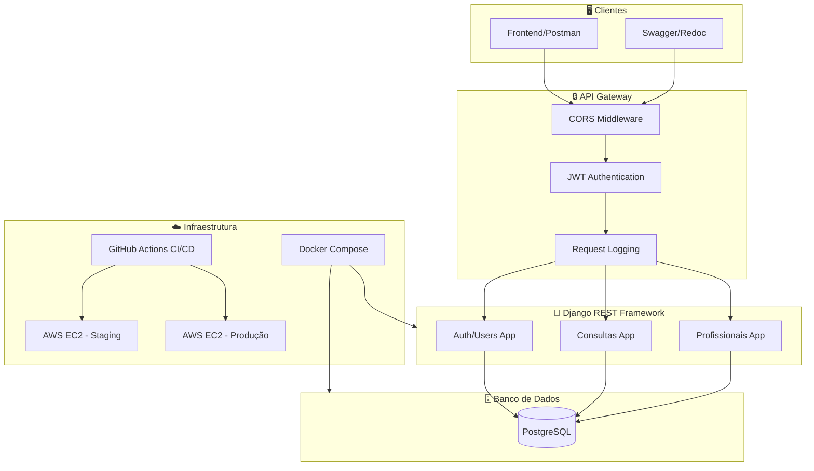
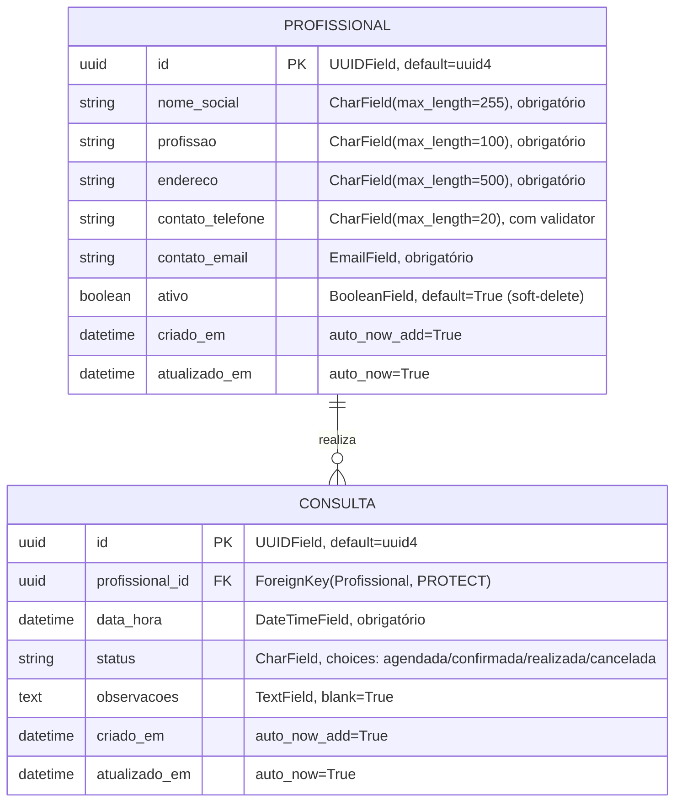
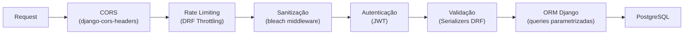
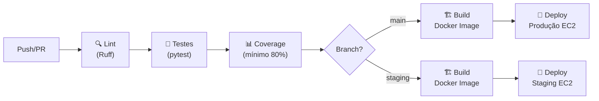
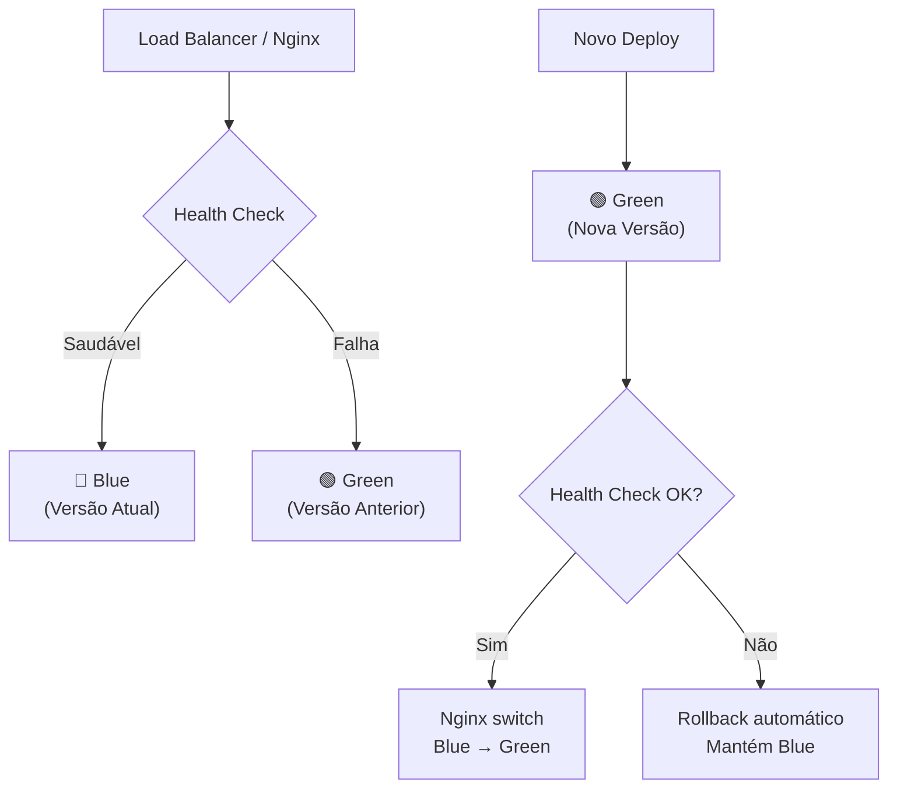

# 📋 Plano de Ação — API Lacrei Saúde

> **Status:** ✅ Decisões aprovadas — Pronto para execução
> **Data:** 2026-09-10
> **Revisado por:** Hermann + Claude Opus 4.6

---

## 0. Decisões Técnicas Aprovadas

> Estas decisões foram discutidas, justificadas e **aprovadas pelo Hermann** antes da implementação.
> Todos os agentes DEVEM seguir estas decisões sem desvios.

| # | Questão | Decisão Aprovada | Justificativa |
|---|---------|------------------|---------------|
| 1 | **Exclusão de registros** | **Soft-delete (inativação)** | Dados de saúde não devem ser apagados permanentemente. Profissionais recebem `ativo=False`, consultas recebem `status=cancelada`. Referência: LGPD + Clean Architecture (Robert C. Martin) |
| 2 | **Campos da Consulta** | **Com `status` + `observacoes`** | Consulta tem ciclo de vida: agendada → confirmada → realizada / cancelada. Demonstra pensamento de produto |
| 3 | **Endereço do Profissional** | **Texto simples (`CharField`)** | Prazo de 5 dias não justifica normalização. Deixar `# TODO` para evolução futura |
| 4 | **Contato do Profissional** | **Separado: `contato_telefone` + `contato_email`** | Campo genérico "contato" é anti-pattern (viola SRP). Campos separados permitem validação específica |
| 5 | **Linter/Formatter** | **Ruff** (substitui flake8 + black + isort) | 10-100x mais rápido, 1 ferramenta, config unificada no `pyproject.toml` |
| 6 | **Deploy AWS** | **EC2 + Docker Compose + Nginx** | Pragmático para 5 dias, cumpre requisito AWS, Blue/Green via GitHub Actions |

---

## 1. Visão Geral da Arquitetura



---

## 2. Estrutura de Diretórios

```
proj-lacrei/
├── plan/                            # Documentação de planejamento
│   ├── planejamento.md              # Este arquivo
│   └── multiagentes.md              # Esquema de execução multiagentes
├── .github/
│   └── workflows/
│       ├── ci.yml                   # Lint (Ruff) + Testes (pytest)
│       └── cd.yml                   # Build Docker + Deploy (staging/prod)
├── docker/
│   ├── Dockerfile                   # Multi-stage build (builder + runtime)
│   ├── entrypoint.sh                # Script de entrada do container
│   └── nginx/
│       └── default.conf             # Configuração do Nginx
├── lacrei_saude/                    # Projeto Django principal
│   ├── __init__.py
│   ├── settings/
│   │   ├── __init__.py              # Detecta ambiente via DJANGO_SETTINGS_MODULE
│   │   ├── base.py                  # Configurações compartilhadas
│   │   ├── local.py                 # Dev: DEBUG=True, SQLite opcional
│   │   ├── staging.py               # Staging: DEBUG=False, PostgreSQL
│   │   └── production.py            # Prod: DEBUG=False, segurança máxima
│   ├── urls.py                      # URLs raiz com include dos apps
│   ├── wsgi.py
│   └── asgi.py
├── apps/
│   ├── __init__.py
│   ├── profissionais/               # App: Profissionais da saúde
│   │   ├── __init__.py
│   │   ├── models.py                # Model Profissional (UUID, soft-delete)
│   │   ├── serializers.py           # Validação + sanitização
│   │   ├── views.py                 # ModelViewSet com soft-delete
│   │   ├── urls.py                  # Router DRF
│   │   ├── filters.py               # django-filter: busca por profissão, nome
│   │   ├── admin.py                 # Registro no admin
│   │   └── tests/
│   │       ├── __init__.py
│   │       ├── test_models.py
│   │       ├── test_serializers.py
│   │       └── test_views.py
│   ├── consultas/                   # App: Consultas médicas
│   │   ├── __init__.py
│   │   ├── models.py                # Model Consulta (FK profissional, status)
│   │   ├── serializers.py           # Validação + status enum
│   │   ├── views.py                 # ModelViewSet + busca por profissional
│   │   ├── urls.py                  # Router DRF
│   │   ├── filters.py               # django-filter: busca por data, status
│   │   ├── admin.py
│   │   └── tests/
│   │       ├── __init__.py
│   │       ├── test_models.py
│   │       ├── test_serializers.py
│   │       └── test_views.py
│   └── autenticacao/                # App: Autenticação JWT
│       ├── __init__.py
│       ├── models.py
│       ├── serializers.py
│       ├── views.py
│       ├── urls.py
│       ├── backends.py
│       └── tests/
│           ├── __init__.py
│           └── test_auth.py
├── core/                            # Código compartilhado
│   ├── __init__.py
│   ├── middleware/
│   │   ├── __init__.py
│   │   ├── logging.py               # Log de acesso e erros (stdout)
│   │   └── sanitization.py          # Sanitização com bleach
│   ├── exceptions.py                # Exception handler global DRF
│   ├── permissions.py               # Permissões customizadas
│   └── pagination.py                # Paginação padrão (PageNumberPagination)
├── docs/
│   ├── ROLLBACK.md                  # Proposta Blue/Green com diagramas
│   ├── ASSAS_INTEGRACAO.md          # Proposta de integração com Assas
│   └── DECISOES_TECNICAS.md         # Justificativas detalhadas
├── pyproject.toml                   # Poetry + Ruff config
├── docker-compose.yml               # Local: Django + PostgreSQL
├── docker-compose.staging.yml       # Staging: + Nginx
├── docker-compose.prod.yml          # Prod: + Nginx + configs seguras
├── manage.py
├── .env.example                     # Template de variáveis de ambiente
├── README.md                        # Documentação principal
└── Makefile                         # Atalhos: make run, make test, etc.
```

---

## 3. Modelagem de Dados



### Regras de negócio dos models:

**Profissional:**
- `id`: UUID v4, gerado automaticamente (nunca expor IDs sequenciais)
- `nome_social`: obrigatório, respeita identidade de gênero
- `profissao`: obrigatório (ex: "Médica", "Psicóloga", "Dentista")
- `endereco`: texto livre (max 500 chars)
- `contato_telefone`: validação regex para formato brasileiro `(XX) XXXXX-XXXX`
- `contato_email`: validação nativa do `EmailField`
- `ativo`: `True` por padrão; `DELETE` muda para `False` (soft-delete)
- `__str__`: retorna `nome_social - profissao`

**Consulta:**
- `id`: UUID v4
- `profissional`: FK com `on_delete=PROTECT` (não permite deletar profissional com consultas)
- `data_hora`: obrigatório, deve ser no futuro (validação no serializer)
- `status`: default `agendada`, choices: `agendada`, `confirmada`, `realizada`, `cancelada`
- `observacoes`: opcional, texto livre
- `DELETE`: muda status para `cancelada` (não remove do banco)

---

## 4. Endpoints da API

### Autenticação
| Método | Endpoint | Descrição | Auth? |
|--------|----------|-----------|-------|
| `POST` | `/api/v1/auth/token/` | Obter par de tokens JWT (access + refresh) | ❌ |
| `POST` | `/api/v1/auth/token/refresh/` | Renovar access token | ❌ |

### Profissionais
| Método | Endpoint | Descrição | Auth? |
|--------|----------|-----------|-------|
| `GET` | `/api/v1/profissionais/` | Listar profissionais ativos (paginado) | ✅ |
| `POST` | `/api/v1/profissionais/` | Criar profissional | ✅ |
| `GET` | `/api/v1/profissionais/{id}/` | Detalhar profissional | ✅ |
| `PUT` | `/api/v1/profissionais/{id}/` | Atualizar profissional (completo) | ✅ |
| `PATCH` | `/api/v1/profissionais/{id}/` | Atualizar profissional (parcial) | ✅ |
| `DELETE` | `/api/v1/profissionais/{id}/` | Inativar profissional (soft-delete) | ✅ |
| `GET` | `/api/v1/profissionais/{id}/consultas/` | Listar consultas do profissional | ✅ |

### Consultas
| Método | Endpoint | Descrição | Auth? |
|--------|----------|-----------|-------|
| `GET` | `/api/v1/consultas/` | Listar consultas (paginado, filtrável) | ✅ |
| `POST` | `/api/v1/consultas/` | Criar consulta | ✅ |
| `GET` | `/api/v1/consultas/{id}/` | Detalhar consulta | ✅ |
| `PUT` | `/api/v1/consultas/{id}/` | Atualizar consulta (completo) | ✅ |
| `PATCH` | `/api/v1/consultas/{id}/` | Atualizar consulta (parcial) | ✅ |
| `DELETE` | `/api/v1/consultas/{id}/` | Cancelar consulta (status=cancelada) | ✅ |

### Documentação
| Método | Endpoint | Descrição | Auth? |
|--------|----------|-----------|-------|
| `GET` | `/api/v1/docs/` | Swagger UI (drf-spectacular) | ❌ |
| `GET` | `/api/v1/redoc/` | ReDoc (drf-spectacular) | ❌ |
| `GET` | `/api/v1/schema/` | OpenAPI 3.0 JSON/YAML | ❌ |

---

## 5. Stack Técnica

### Dependências de Produção
| Pacote | Versão | Finalidade |
|--------|--------|------------|
| `python` | 3.12 | Runtime |
| `django` | >=5.1,<6.0 | Framework web |
| `djangorestframework` | >=3.15,<4.0 | API REST |
| `djangorestframework-simplejwt` | >=5.3 | Autenticação JWT |
| `django-cors-headers` | >=4.4 | Configuração CORS |
| `django-filter` | >=24.0 | Filtragem nos endpoints |
| `drf-spectacular` | >=0.27 | OpenAPI 3.0 (Swagger/ReDoc) |
| `bleach` | >=6.1 | Sanitização de inputs |
| `psycopg[binary]` | >=3.2 | Driver PostgreSQL (psycopg3) |
| `gunicorn` | >=22.0 | WSGI server produção |
| `python-decouple` | >=3.8 | Variáveis de ambiente |

### Dependências de Desenvolvimento
| Pacote | Versão | Finalidade |
|--------|--------|------------|
| `ruff` | >=0.6 | Linter + formatter |
| `pytest` | >=8.0 | Framework de testes |
| `pytest-django` | >=4.8 | Integração pytest + Django |
| `pytest-cov` | >=5.0 | Cobertura de testes |
| `factory-boy` | >=3.3 | Factories para testes |
| `model-bakery` | >=1.18 | Geração de dados de teste |

---

## 6. Segurança



| Ameaça | Proteção | Implementação |
|--------|----------|---------------|
| SQL Injection | ORM do Django | Queries parametrizadas, nunca usar `raw()` ou `extra()` |
| XSS | Sanitização | Middleware com `bleach.clean()` em todos os inputs string |
| CORS indevido | Whitelist | `CORS_ALLOWED_ORIGINS` com lista explícita de domínios |
| Brute Force | Rate limiting | `DEFAULT_THROTTLE_RATES` do DRF: `anon: 20/min`, `user: 60/min` |
| Token roubo | JWT curto | Access token: 30min, Refresh token: 1 dia |
| Dados expostos | Env vars | `python-decouple` com `.env`, nunca hardcoded |
| Enumeração de IDs | UUID | IDs não sequenciais, impossível adivinhar |

---

## 7. Pipeline CI/CD



---

## 8. Proposta de Rollback (Blue/Green)



**Mecanismo:**
1. Deploy novo container como "Green" em porta alternativa
2. Health check no endpoint `/api/v1/health/`
3. Se OK: Nginx redireciona tráfego para Green
4. Se falha: Green é removido, Blue continua servindo
5. GitHub Actions automatiza todo o fluxo

---

## 9. Ordem de Implementação (Fases)

| Fase | Agente | Entrega | Dependência |
|------|--------|---------|-------------|
| **1** | ⚙️ Infraestrutura | Poetry, Django, Docker, Settings, Makefile | Nenhuma |
| **2** | 🏗️ Domínio | Models, Serializers, Views, URLs (CRUD) | Fase 1 |
| **3** | 🔒 Segurança | JWT, CORS, Sanitização, Logging, Rate Limiting | Fase 2 |
| **4** | 🧪 Testes | APITestCase completo, coverage >= 80% | Fases 2+3 |
| **5** | 🚀 DevOps | GitHub Actions CI/CD | Fases 1+4 |
| **6** | 📚 Documentação | README, Swagger, Rollback, Decisões, Assas | Todas |

> Ver `plan/multiagentes.md` para detalhamento completo de cada agente.
